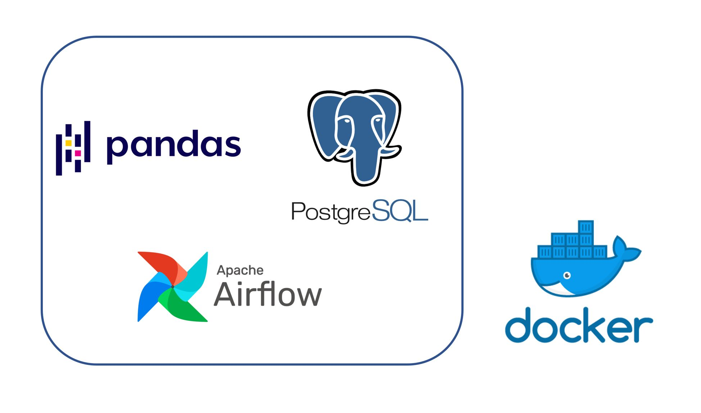

# Desafio - Dev Python

 
 
O teste foi realizado em duas etapas:
 
 
Analise de dados

 

 

- Transformação dos dados e posteriormente hospedagem dos dados
em um banco RDS na AWS.

 

- Os dados utilizados no notebook usam a bibioteca psycopg2 para se conectar
ao banco na AWS

 

- A análise de dados focou em confirmar 9 hipóteses formuladas que baseiam-se
em afirmações que ouvimos no nosso cotidiano sobre os fatores que influenciam
no aumento dos rendimentos de um indivíduo.

- Os requisitos são um computador com python e as bibliotecas Numpy, Pandas, Scipy, Statsmodel, Matplotlib e Seaborn
 
 
 

Processo ETL

- O processo foi criado utilizando o Airflow em conjunto com o docker

- Escolheu-se essa estratégia para ser possível rodar os códigos em qualquer plataforma

- O único requisito para rodar o código é possuir o Docker no computador

- As instruções estão no arquivo instrucoes.pdf

