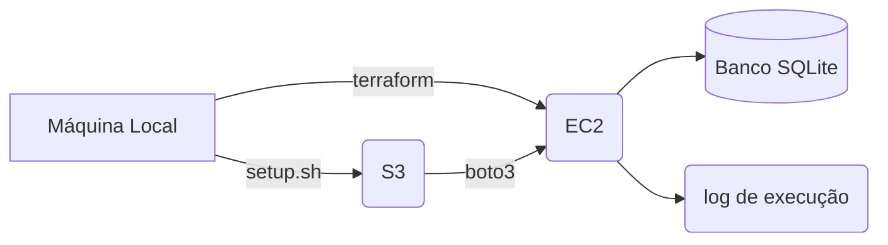

# python-dev-test clicksign

Pre-requisitos

1. Fonte de dados fixa: datasets fornecidos neste repositório;
2. Processar todos os arquivos de dados fornecidos;
3. Executar a cada 10 segundos processando 1.630 registros;
4. Objetivo do arquivo transformado é "acessar dados úteis que possibilitem a extração de insights";
5. Carregar os dados processados em um banco de dados;
6. Respeitar a tipagem dos dados e o nome das colunas fornecidas no arquivo de descrição;
7. Utilizar alguma tecnologia de agendamento;
8. Utilizar a linguagem de programação Python;

Decisões

1. Utilizar tecnologia AWS compatível com o objetivo da vaga;
2. Utilizar Terraform para facilitar a reprodução da solução e a explicação;
3. Utilizar banco de dados SQLite por ser gratuito. Postgres exigiria uma máquina EC2 maior ou um RDS com custo maior na AWS;
4. Parametrizar as entradas, pois é uma boa prática;
5. Por simplificação utilizarei uma única camada com o arquivo processado. Não utilizarei uma camada de cópia do arquivo e nem camadas intermediárias de transformação.

## Arquivos no diretório

|ARQUIVO|DESCRIÇÃO|
|---|---|
|etl.py|Programa Python para fazer a Extração Transformação e Carga dos Registros|
|params.py|Os parâmetros sensiveis e/ou alteráveis de execução foram guardados em um arquivo json no S3. Para acessa-los precisamos saber o nome do arquivo e onde está. Esta é a função deste arquivo de parâmetros, informar o bucket e o nome do arquivo json com todos os parâmetros necessários para execução.|
|parametros.json|Parâmetros necessários para execução como local do arquivo origem, quantidade de registros por carga, informações do banco de dados...|
|setup.sh|sobe os arquivos iniciais para o bucket e copia o banco de dados e o log da execução anterior.|
|us_census_bureau.db|banco de dados com a carga completa dos dados|
|crontab.txt|amostra do arquivo utilizado para parametrizar a máquina EC2|
|start.sh|arquivo utilizado na máquina EC2 para instalar dependências do Python via pip, copiar os arquivos de execução (aqueles que subiram com o setup.sh) do S3 para máquina EC2, configurar o crontab e preparar o ambiente.|
|us-bureau.ipynb|arquivo utilizado para fazer os primeiros testes e preparar o programa etl.py. Se não tiver o Jupyter instalado em sua máquina pode abrir o arquivo com o https://colab.research.google.com/ do Google.|
|us_census_bureau.log|log de uma execução do programa etl.py em uma máquina EC2.|
|aws_terraform/main.tf|Instrução para o terraform executar.|

## Como funciona?



Atenção 1

>Para executar em uma máquina EC2 utilizando Terraform você terá que ter o CLI da AWS instalado na máquina e configurado para sua conta, permissão de acesso ao S3 e criação de EC2, Terraform instalado na sua máquina além do Python instalado na sua máquina.

Atenção 2

>Fiz todo o processo em uma máquina Linux então os arquivos executáveis locais tem a extensão `.sh` e não `.bat` como no Windows. Todo o processo é pensado para executar a partir de uma máquina Linux. 

Atenção 3

>Caso você não queira executar o processo em um EC2 é possível executar local com o mesmo arquivo etl.py.

### Receita Passo a Passo AWS

Pre-requisitos:

1. Máquina linux (debian, ubuntu)
2. Bucket na AWS e configuração local para CLI
3. Permissão na AWS para executar os comandos
4. Arquivo pem para permitir acesso local a máquina AWS.
5. Alterar o arquivo `parametros.py` e `parametros.json` com os dados de parâmtros conforme a sua execução. Será necessário configurar pelo menos o nome do bucket.

O arquivo de setup copia o log e o banco de dados da execução anterior do S3 para a máquina local. Depois ele apaga o arquivo da execução no S3. Se não teve execução anterior ele não copia e nem apaga nada ;)

Feita a cópia da execução anterior o setup copia para o S3 os arquivos etl.py (responsável pelo ETL), parametros.json e parametros.py (responsáveis pelos parâmetros de execução do Python).

No final ele lista tudo que está no S3 para você ter certeza que foi feito corretamente.

```bash
chmod +x setup.sh
./setup.sh
```

O próximo passo é criar o EC2 e executar a carga.

```bash
cd ./aws_terraform
terraform init
terraform apply
```

Para acompanhar:

1. Entre no portal da AWS, EC2, selecione a máquina `us-bureau`, clique em conectar. Copie o comando ssh para entrar na máquina. Após conectar remotamente na máquina EC2 digite o comando `tail -f etl.log` para acompanhar o log de execução. Quando a máquina terminar irá desligar automatimente.
2. Ou, é possível acompanhar se a máquina está funcionando pelo portal AWS sem conectar. Para no final encerrar o EC2.
3. Ou... Por outro lado o código etl.py está programado para fazer uma cópia dos dados quando terminar e encerrar a máquina. Então se não quiser abrir o portal da AWS você pode ficar monitorando o bucket se já possui os arquivos de saída (us_census_bureau.log e us_census_bureau.db) com o comando `aws s3 ls s3://nome-do-bucket/`, onde `nome-do-bucket` é o nome do bucket que você colocou nos parâmetros. 

Após encerrar você pode copiar os arquivos para sua máquina com o comando `setup.sh` e destruir a máquina EC2 para não ficar gastando dinheiro com espaço de armazenamento ou processamento. O comando copia os arquivos do bucket para a pasta onde for executado. São dois arquivos `us_census_bureau.db` (banco de dados SQLite) e `us_census_bureau.log` (log de execução).  

```bash
./setup.sh
terraform destroy
```

### Receita Passo a Passo Local

Para executar local basta conferir o arquivo de parâmetros se está tudo em ordem (mais detalhes abaixo) e rodar os comandos. Lembrando que mesmo executando local alguns arquivos de origem são esperados em um bucket AWS (variável meu_s3 no arquivo json).

pre-requisitos:

1. máquina linux (debian, ubuntu)
2. bucket na AWS e configuração local para CLI
3. permissão na AWS para executar os comandos
4. bibliotecas python instaladas na máquina local (pandas, boto3, db-sqlite3)

```bash
# copia os arquivos origem para o bucket AWS
./setup.sh
# cria a pasta para saída dos arquivos e dá as permissões necessárias
sudo mkdir /home/ec2-user/
sudo chown $(whoami):$(whoami) /home/ec2-user/
cp ./etl.py /home/ec2-user/
cp ./parametros.json /home/ec2-user/
cp ./params.py /home/ec2-user/
cp ./crontab.txt /home/ec2-user/
# dá permissão de execução pro ETL
cd /home/ec2-user/
chmod +x etl.py
# atualiza o crontab com os dados do arquivo crontab.txt para agendar a execução a cada 10 segundos
crontab crontab.txt
# mostra pra vocẽ que deu tudo certo
crontab -l
```

>Nesse caso ele está programado para desligar a máquina quando terminar. Comente a linha 182 do `etl.py` se você não quiser presenciar um shutdown da sua máquina. E acompanhe pelo arquivo `/home/ec2-user/etl.log` se já terminou.

## Arquivo de Parâmetros

- **githubPath** - lista dos arquivos de origem
- **db_name** - nome completo do banco de dados no formato `/pasta/nome-arquivo`
- **qtd_linhas_por_carga** - quantidade de linhas inseridas por carga
- **meu_s3** - nome do bucket S3 na AWS
- **log_file** - nome do arquivo de log no formato `/pasta/nome-arquivo`

```json
{"githubPath": "https://raw.githubusercontent.com/clicksign/python-dev-test/master/data/Adult.data",
"db_name": "/home/ec2-user/us_census_bureau.db",
"qtd_linhas_por_carga": 1630,
"meu_s3": "s3://nome-do-bucket/",
"log_file": "/home/ec2-user/etl.log"}
```

## Processo dentro da máquina EC2

Ordem de execução:

1. O terraform copia o arquivo start.sh para a máquina, dá a permissão de execução e chama o arquivo.
2. O arquivo start.sh instala as bibliotecas Python necessárias, copia os arquivos para execução e configura o crontab. O resultado desse processo está no início do arquivo de log.
3. O crontab chama o arquivo etl.py a cada 10 segundos que fará a carga dos arquivos que estão no parâmetro `parametro.json` (arquivo que fica no bucket).
4. Ao finalizar a carga dos arquivos o próprio `etl.py` tem uma função chamada `acabou()` que limpa o crontab (isso é mais útil quando a execução é local), transfere os arquivos `us_census_bureau.db` (banco de dados SQLite) e `us_census_bureau.log` (log de execução) para o S3, chama o script `finaliza.sh`.
5. O script `finaliza.sh` espera 30 segundos para o Python gravar o log e ter certeza que o arquivo foi transferido e encerra a máquina.

## Jeito super fácil

Se você está pensando "Pra quê tudo isso"? Eu tenho uma alternativa, um código super simples que faz a carga. Pode testar utilizando o Jupyter anexo chamado `super-easy.ipynb` ou copiando o código abaixo. :)

```python
import pandas as pd
import sqlite3
from time import sleep

db_name = 'us_census_bureau_easy.db'

conn = sqlite3.connect(db_name)  # conexão com o banco

data = pd.read_csv(
    "https://raw.githubusercontent.com/clicksign/python-dev-test/master/data/Adult.data",
    names=[
        'age', 'workclass', 'fnlwgt', 'education', 'education-num',
        'marital-status', 'occupation', 'relationship', 'race', 'sex',
        'capital-gain', 'capital-loss', 'hours-per-week', 'native-country',
        'class'
    ])

test = pd.read_csv(
    "https://raw.githubusercontent.com/clicksign/python-dev-test/master/data/Adult.test",
    names=[
        'age', 'workclass', 'fnlwgt', 'education', 'education-num',
        'marital-status', 'occupation', 'relationship', 'race', 'sex',
        'capital-gain', 'capital-loss', 'hours-per-week', 'native-country',
        'class'
    ])

df = pd.concat([data, test])
qtd = len(df)

while qtd > 0:
    insere = df.tail(1630).index
    df.drop(insere, inplace=True)
    df.to_sql('df', con=conn, index=False, if_exists='append')
    qtd = len(df)
    print(qtd)
    sleep(10)
```
