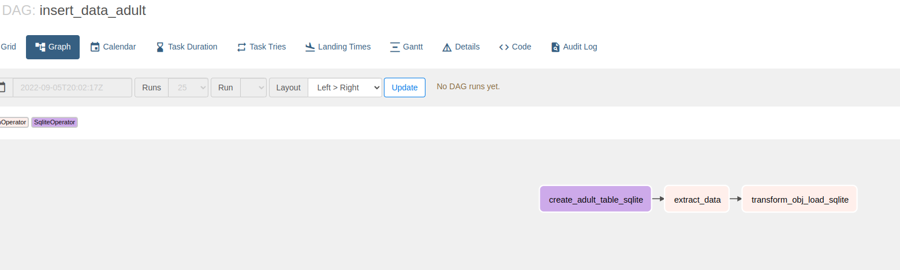
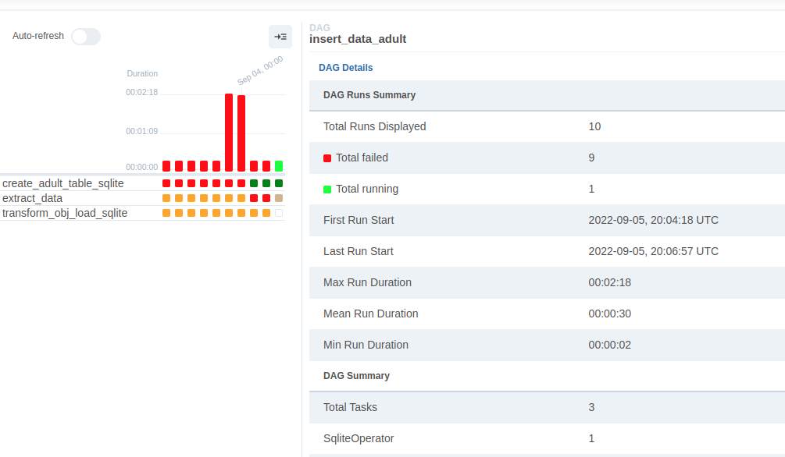
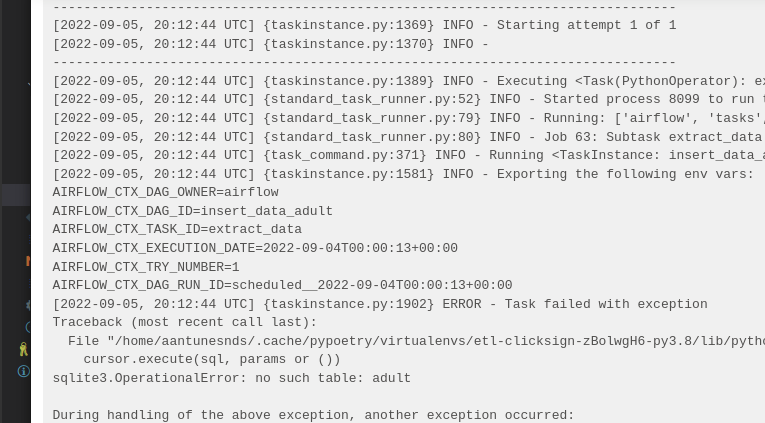
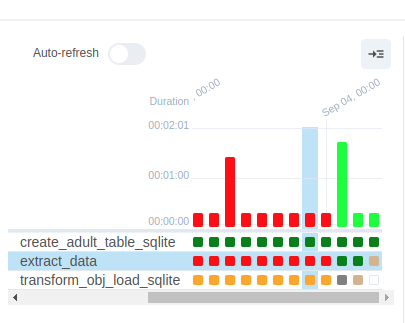
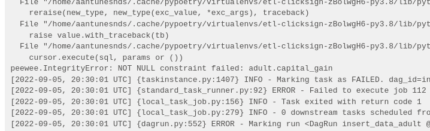
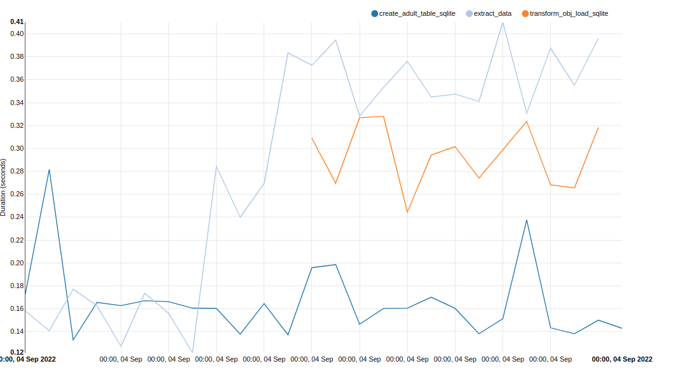
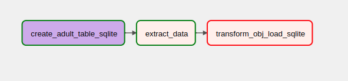

## Estrutura do projeto

#### Gerenciamento de dependências: *Poetry*

### Principais Artefatos

1. Banco de dados (adult)
    - Model Class com SQLite e Peewe ORM (etl_clicksign/models.py)
2. DAG Airflow que carrega os dados no banco
    - Todo processo ETL 3 tasks(etl_clicksign/dag.py)
        * **create_table_sqlite_task** que inicializa criando a tabela caso ela nao exista
        * **extract** responsavel por extrair os dados dentro do split pedido 1.630 linhas por execução. Aqui eh usado o algortimo de extraçao (etl_clicksign/algorithms.py)
        * **transform_load** responsáveil por carregar e inserir os dados no banco (utilizando o ORM) 
3. Testes unitários
    - Model Tests usando mocks, assertando o objeto no banco, limpando o banco e manipulando os dados do Adult.data com pandas(tests/test_models.py)
    - Um arquivo para testar durante o desenvolvimento algumas funcionalidades mais triviais do programa
4. Exploração de dados 
    - Exploração simples de dados usando jupyter (adult_data.ipynb)

### Airflow

*Antes de tudo quero deixar claro que nunca havia tido contato com o Airflow, dito isso, o que segue são tentativas do aprendizado que tive durante o desenvolvimento do teste.*

- Instalei o Airflow no poetry e localmente ele criou um diretório **airflow** no meu /home. Nele criei a pasta *dags* e importei o código na estrutura citada acima para esse diretório. Acredito que num caso de uso real isso seja colocado em containers.

- Feito isso consegui abrir a Gui do browser e tive alguns problemas de imports e de código do proprio Airflow, nada demais. 

- Descobri que a granularidade do scheduler do Airflow não aceita menos que 1 minuto (ou eu não soube ajustar) 

- Também fui tendo problema em cada task especifica, Tanto de criaçao de tabela ja existente como a inserçao nela. Fui monitorando os erros pelos arquivos criados dentro da pasta home/airflow/logs e também pela Gui

- Nesse ponto acredito que ter utilizado um ORM (Peewee) me complicou um pouco. Também nunca tinha utilizado. Acho que o ideal era ter feito tudo com python puro sem ORM algum.

- Depois de algumas tentativas consegui fazer as 2 primeiras tasks da Dag rodarem corretamente. Depois comecei ter mais problemas com o ORM. Nesse ponto acredito que já consegui entender o básico do Airflow e acabei descobrindo mais uma utilidade pra um Grafo Direcionado! =D

